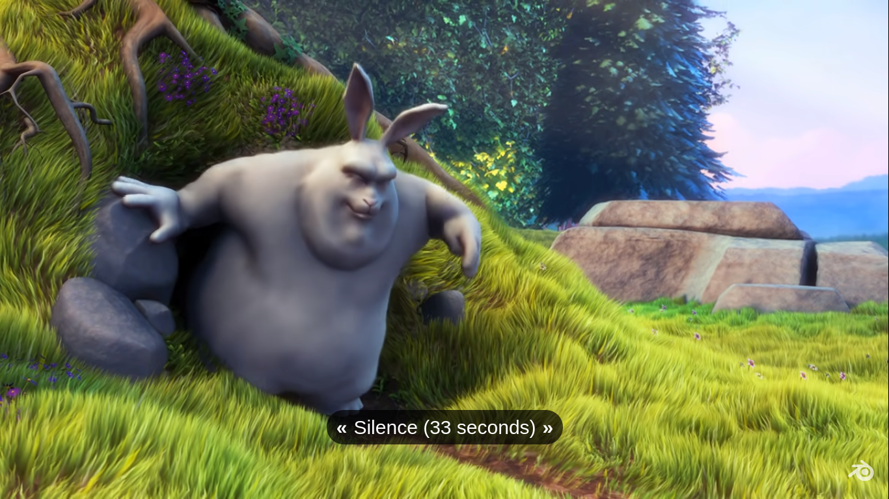
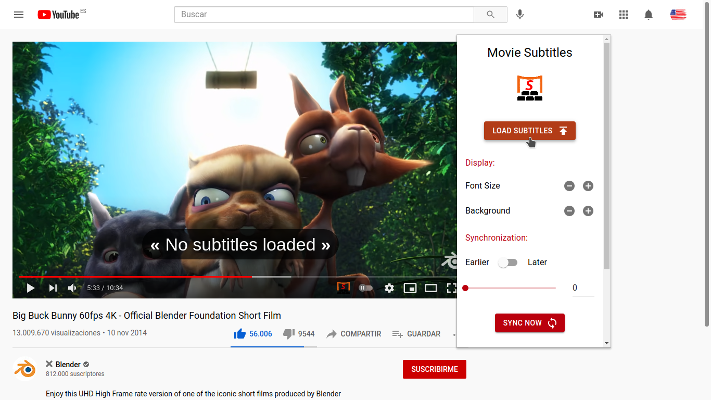
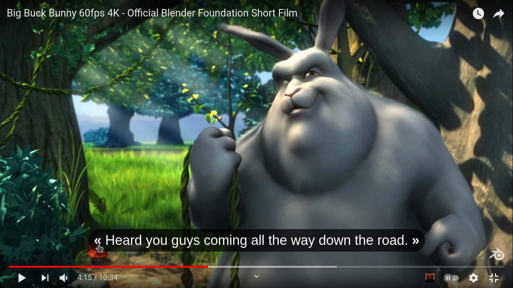
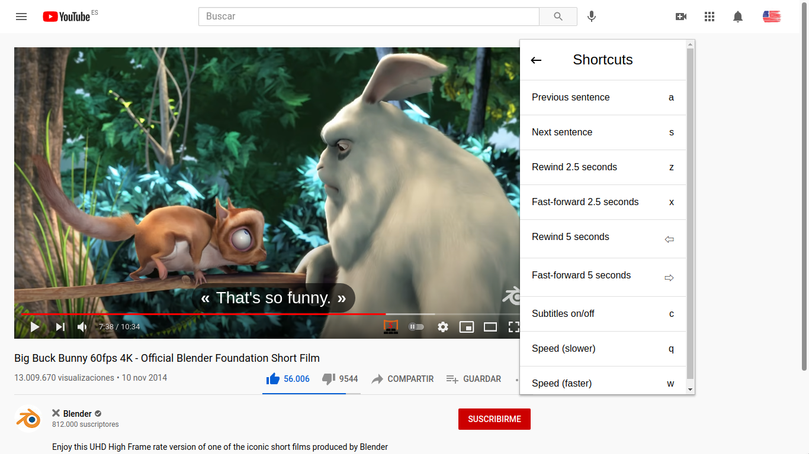

# Movie Subtitles

Add your own subtitles on almost any video/movie streaming platform you can think of, such as Amazon Prime, Disney Plus, Netflix (with some restrictions), Youtube, Twitch and many more!

## Installation

Movie Subtitles is an open-source Chrome Extension and can be downloaded from the Chrome Web Store.  
To install it please follow [this link](https://chrome.google.com/webstore/detail/movie-subtitles/ifimcneililngppkpddcliecbpcgdjag?hl=de), then click `install`.

## Adding Subtitles

Unfortunately, Movie Subtitles does not have a subtitle search.
You have to download the subtitles online before you can use them in the extension.
There are many websites that offer free subtitles. Two of the most popular ones are [Open Subtitles](https://opensubtitles.org) and [Yify Subtitles](https://yts-subs.com).
Once you've got the subtitles you're good to go!

> Note: Movie Subtitles supports `.txt`, `.srt`, and `.sub` files. If your subtitles are inside a compressed archive/zip folder, you will have to extract/unzip them first.

## Useful Features

Didn't catch a phrase? Listen to it again by clicking the arrow next to the subtitles. Make sure to enable the silence indicator in the settings before using this feature!

Want to use convenient shortcuts? There's a variety of shortcuts you can use.

> Note that Netflix restricts the functionality of browser extensions. For this reason, some shortcuts and functionalities are not available on Netflix!

## Other Useful Features

- Synchronization (show subtitles a little earlier/later)
- Style (adjust the subtitle size, background, and position)
- Over 40 supported languages (upload subtitles in almost any language you want)
- Skip Music (for this, choose subtitle files that indicate music with ♪ or [Music])
- Skip Silence (for this, enable the Silence Indicator in the main menu)
- Select/Copy subtitle text (for this, enable Edit Mode in the main menu)

## Skipping Violent Scenes and Adult Content

I wrote an article on Medium regarding this. Check it out [here](https://gignu.medium.com/how-to-skip-violent-scenes-and-adult-content-in-movies-3c7d89b813ad)!

## Contributing

Movie Subtitles is an open-source project. If you have any ideas for improvement, want to report a bug, or contribute in some other way, you're welcome to do so! Feel free to take a lok at the [Contributing Guide](https://github.com/gignupg/Movie-Subtitles/blob/master/CONTRIBUTING.md).

## Credits

- Logo inspired by [icons8](https://icons8.com/icons/set/movie-theater)
- The extension was built using [Ixieyang's](https://github.com/lxieyang/chrome-extension-boilerplate-react) React Boilerplate
- Screenshots from [Big Buck Bunny](https://www.youtube.com/watch?v=aqz-KE-bpKQ)

## License

This project is licensed under the MIT License

